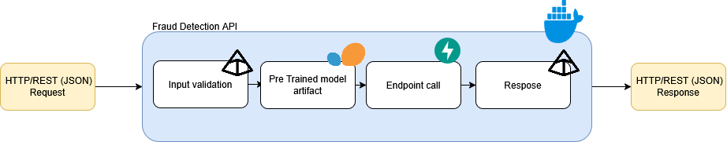

# 🚀 Fraud Detection API

A FastAPI-based machine learning API for predicting credit card fraud using logistic regression.

## ✨ Features

* 🎯 RESTful API for fraud prediction on credit card transactions
* 🤖 Pre-trained logistic regression model for binary classification
* 📊 Automatic feature extraction from transaction data


## General Application Diagram



## 🐳 Docker Setup

### 📋 Prerequisites

* Docker
* Docker Compose

### 🚀 Quick Start

1. **Build and run with Docker Compose:**

   ```bash
   docker-compose up --build
   ```

   The API will be available at `http://localhost:8080`

2. **Access the API documentation:**

   Open your browser and navigate to `http://localhost:8080/docs` to view the interactive Swagger UI.

## 🔌 API Endpoints

* `GET /` - API information
* `GET /api/health` - Health check
* `POST /api/predict` - Predict fraud for a transaction

## 📊 Input Data Structure

The prediction endpoint accepts:

* `merchant` - Merchant name
* `category` - Transaction category
* `city`, `state` - Location information
* `job` - Cardholder's job
* `amt` - Transaction amount
* `lat`, `long` - Geographic coordinates
* `city_pop` - City population
* `trans_date_trans_time` - ISO 8601 datetime (e.g., "2025-12-04T14:30:00")

## 📁 Project Structure

```
.
├── Dockerfile
├── docker-compose.yaml
├── requirements.txt
├── .dockerignore
├── api.py               # FastAPI application
├── basemodel.py         # Pydantic models
├── exploration.ipynb    # Exploratory analysis notebook
├── artifacts/
│   └── fraud_model.pkl  # Pre-trained model
└── data/
    └── fraud_data.csv   # Training dataset
```

## 🔄 Notebook Reproducibility

To run the exploration notebook and reproduce the analysis:

1. **Create a virtual environment:**

   ```bash
   python -m venv venv
   ```

   On Windows (PowerShell):
   ```powershell
   venv\Scripts\Activate.ps1
   ```

   On macOS/Linux:
   ```bash
   source venv/bin/activate
   ```

2. **Install dependencies:**

   ```bash
   pip install -r requirements.txt jupyter
   ```


4. **Execute the notebook cells** to reproduce the analysis and model training.

The notebook is configured to work with the pre-trained model stored in `artifacts/fraud_model.pkl`. Running the notebook will regenerate the model if needed.
